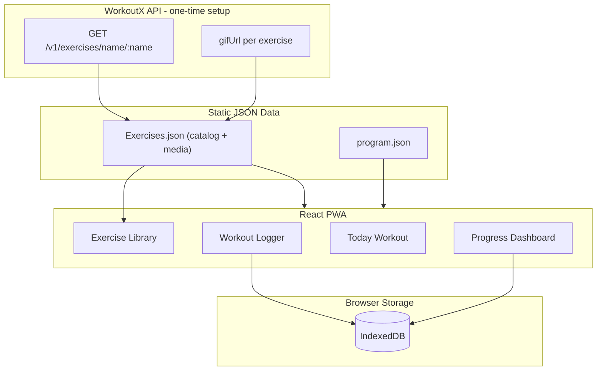

# Unleashed Beginner Training App — Implementation Plan

## Current State

**Already done — exercise catalog:** [`Exercises.json`](c:\Users\YSHAMIS\OneDrive - AMDOCS\GenAI Training\Unleashed\Exercises.json) is the **single source of truth** for all program exercises. It already contains **53 entries** with `id`, `name`, and `category`. No separate exercise list needs to be created or extracted from the PDF.

**Still needed:** The PDF `Vitaliy_Fechuk_Unleashed_Beginner.pdf` is not yet in the repo — only the weekly **schedule** (sets, reps, rest, day structure) must be transcribed from it into `program.json`, referencing `exercise_id` values that already exist in `Exercises.json`.

**Your choices:** Web PWA (installable on phone) + local-only progress storage (no login).

---

## Architecture Overview



**Stack:** React 18 + TypeScript + Vite + `vite-plugin-pwa` + Tailwind CSS + Recharts (progress charts) + Dexie.js (IndexedDB wrapper).

**Why IndexedDB over localStorage:** Workout logs grow over months; IndexedDB handles structured queries (e.g. "all pull-up logs") and larger payloads without blocking the UI.

---

## Phase 1 — Add Source Material and Digitize the Program

### 1.1 Add the PDF to the project

Place the file at:

`docs/Vitaliy_Fechuk_Unleashed_Beginner.pdf`

This keeps source material versioned alongside the app.

### 1.2 Transcribe the program into structured JSON

Create [`program.json`](program.json) at project root (alongside `Exercises.json`) by reading the PDF week-by-week. Expected structure (adjust field names to match what the PDF actually contains):

```json
{
  "program_name": "Unleashed Beginner",
  "author": "Vitaliy Fechuk",
  "total_weeks": 12,
  "schedule": [
    {
      "week": 1,
      "days": [
        {
          "day_index": 1,
          "label": "Day 1 — Pull Focus",
          "type": "workout",
          "blocks": [
            {
              "exercise_id": "dead_hang",
              "prescription": { "sets": 3, "duration_sec": 30, "rest_sec": 60 },
              "notes": "From PDF"
            },
            {
              "exercise_id": "pull_ups",
              "prescription": { "sets": 4, "reps": "3-5", "rest_sec": 90 }
            }
          ]
        },
        {
          "day_index": 2,
          "label": "Rest / Cardio",
          "type": "rest",
          "blocks": [
            { "exercise_id": "morning_cardio", "prescription": { "duration_min": 30 } }
          ]
        }
      ]
    }
  ]
}
```

**Prescription types to support** (map from PDF notation):

| PDF notation | `prescription` field |
|---|---|
| `3x8` reps | `{ sets: 3, reps: 8 }` |
| `3x5-8` range | `{ sets: 3, reps_min: 5, reps_max: 8 }` |
| `30 sec hold` | `{ sets: 3, duration_sec: 30 }` |
| `AMRAP` | `{ sets: 1, reps: "amrap" }` |
| Cardio | `{ duration_min: 30 }` |

Every `exercise_id` in `program.json` must reference an existing `id` in [`Exercises.json`](Exercises.json) — do not add new exercise definitions to `program.json`; if the PDF references a move not yet in the catalog, add it to `Exercises.json` first.

### 1.3 Document transcription in a checklist

Create [`docs/program-transcription.md`](docs/program-transcription.md) — a human-readable mirror of the PDF schedule (week/day table) so you can verify the JSON matches the source during build.

---

## Phase 2 — Enrich Existing Exercises with Media (WorkoutX)

**Starting point:** Use the existing [`Exercises.json`](Exercises.json) as-is. This phase only **adds** a `media` object to each entry — no new exercise list file.

### 2.1 Register for WorkoutX API

1. Sign up at [workoutxapp.com](https://workoutxapp.com) (free tier: **500 requests/month**, 30 req/min).
2. Store API key in `.env.local` (never committed):

```
VITE_WORKOUTX_API_KEY=wx_your_key_here
```

### 2.2 Recommended approach: extend Exercises.json in-place, cache URLs

At runtime the app should **not** call WorkoutX on every page load (quota risk, offline breakage). Instead:

1. Run a **one-time mapping script** (`scripts/map-workoutx.mjs`) that reads the existing `exercises` array from `Exercises.json`.
2. For each entry, search WorkoutX by `name` and write `media` fields back into the **same file** (or a copy at `src/data/Exercises.json` consumed by the app).

Target entry shape after enrichment:

```json
{
  "id": "pull_ups",
  "name": "Pull Ups",
  "category": "pull",
  "media": {
    "source": "workoutx",
    "workoutx_id": "0652",
    "gif_url": "https://api.workoutxapp.com/v1/gifs/0652",
    "match_confidence": "exact",
    "fallback": null
  }
}
```

**Mapping script logic:**

```
For each exercise in Exercises.json:
  GET /v1/exercises/name/{encodedName}
  If exact name match → store workoutx_id + gifUrl
  Else if close match → flag for manual review
  Else → mark media.source = "manual", add to fallback list
```

### 2.3 Handle exercises WorkoutX won't have

Specialized calisthenics moves (e.g. `front_lever_30_deg`, `closed_planche`, `body_lift_front_lever`) may not exist in a general database. For these:

- Add `public/gifs/{exercise_id}.gif` manually (record your own, or source from royalty-free calisthenics GIF sites).
- Set `media.source = "local"` and `gif_url = "/gifs/front_lever_30_deg.gif"`.

Target: **100% of exercises** have a visual — WorkoutX URL or local fallback.

### 2.4 Optional: download GIFs for full offline PWA

If you want GIFs available offline (recommended for gym use with poor signal), add a second script `scripts/download-gifs.mjs` that saves GIFs to `public/gifs/` and updates `gif_url` to local paths. One-time cost: ~53 API requests + disk space.

---

## Phase 3 — Application Scaffold

### 3.1 Initialize project

```
npm create vite@latest unleashed-app -- --template react-ts
cd unleashed-app
npm install dexie recharts react-router-dom date-fns
npm install -D tailwindcss @tailwindcss/vite vite-plugin-pwa
```

Keep [`Exercises.json`](Exercises.json) at project root (or copy to `src/data/` for typed imports). Add `program.json` alongside it. The app loads exercises directly from this file — no duplicate catalog.

### 3.2 Folder structure

```
unleashed-app/
  public/
    gifs/                  # local fallback GIFs
    icons/                 # PWA icons (192, 512)
  src/
    data/                  # typed imports of JSON
    db/
      schema.ts            # Dexie tables
    types/
      program.ts
      workout-log.ts
      exercise.ts
    hooks/
      useProgram.ts
      useWorkoutLog.ts
      useProgress.ts
    pages/
      Home.tsx             # today's workout
      Workout.tsx          # active session logger
      Progress.tsx         # charts + history
      ExerciseLibrary.tsx  # browse all exercises
      Settings.tsx         # reset data, start date
    components/
      ExerciseCard.tsx
      SetLogger.tsx
      ProgressChart.tsx
      WeekNavigator.tsx
      WorkoutSummary.tsx
    utils/
      prescription.ts      # parse targets, compare actual vs prescribed
      pr-detection.ts      # personal record logic
```

### 3.3 PWA configuration

In `vite.config.ts`, configure `vite-plugin-pwa` with:

- App name: **Unleashed Beginner**
- `display: "standalone"` (full-screen on phone home screen)
- Cache static assets + local GIFs
- **Do not** cache WorkoutX API responses (use pre-cached URLs instead)

---

## Phase 4 — Core Features

### 4.1 Home — "Today's Workout"

- Compute current position from `userState.startDate` + program schedule, or let user manually pick week/day.
- Show today's prescribed blocks with exercise GIF, target sets/reps/time, and rest timers.
- **Start Workout** button → navigates to active logger.

### 4.2 Active Workout Logger

For each prescribed exercise block:

- Display GIF + instructions (from WorkoutX `instructions` if stored in media map).
- Per-set input: reps completed, duration (for holds), checkbox for done/skipped.
- Optional notes field per exercise.
- Rest timer between sets (countdown from `rest_sec`).
- On finish → save `WorkoutLog` to IndexedDB, update `userState`, detect PRs.

**WorkoutLog schema (IndexedDB):**

```typescript
interface WorkoutLog {
  id: string;              // uuid
  date: string;            // ISO date
  week: number;
  day_index: number;
  started_at: string;
  completed_at: string;
  exercises: {
    exercise_id: string;
    prescribed: Prescription;
    sets: { reps?: number; duration_sec?: number; completed: boolean }[];
    notes?: string;
  }[];
}
```

**UserState (single row in IndexedDB):**

```typescript
interface UserState {
  program_start_date: string;
  current_week: number;
  current_day_index: number;
  total_workouts_completed: number;
}
```

### 4.3 Progress Dashboard

| View | What it shows |
|---|---|
| **Overview** | Current week, workouts completed this week, streak (consecutive training days) |
| **Exercise trend** | Line chart: best reps or hold time per session for selected exercise |
| **Personal records** | Table of PRs per exercise with date achieved |
| **History** | Calendar or list of past workout logs; tap to view detail |
| **Volume** | Weekly total sets per category (pull/push/core/legs) |

Use Recharts `LineChart` for trends, querying Dexie:

```typescript
db.workoutLogs
  .where('exercises.exercise_id').equals('pull_ups')
  .toArray()
```

### 4.4 Exercise Library

- Grid/list of all 53 exercises filtered by category.
- Each card: GIF preview, name, category badge, link to progress chart for that exercise.
- Useful for reviewing form before a session.

---

## Phase 5 — Progress Logic Details

### 5.1 Advancement through the program

Two modes (implement both, default to **calendar-based**):

1. **Calendar-based:** Week N starts `program_start_date + (N-1)*7 days`. User can still log any day manually.
2. **Completion-based (optional toggle):** Advance to next week only after completing all workout days in current week.

### 5.2 Personal record detection

On workout save, for each exercise:

- **Rep-based:** if `max(reps)` > previous PR → update `personalRecords` table.
- **Time-based:** if `max(duration_sec)` > previous PR → update.
- Show toast/badge: "New PR: Pull Ups — 8 reps!"

### 5.3 Prescribed vs actual comparison

In workout summary and progress view, color-code:

- Green: met or exceeded target
- Yellow: within 1 rep/time unit of target
- Red: below target

---

## Phase 6 — UI/UX Guidelines

- **Mobile-first layout** — large tap targets for logging sets mid-workout.
- **Dark theme default** — easier to read in gym lighting.
- **Minimal friction logging** — pre-fill sets from prescription; user only adjusts actual numbers.
- **Offline-first** — app works fully offline after first load (critical for PWA gym use).

**Navigation (bottom tab bar on mobile):**

```
[ Today ] [ Progress ] [ Library ] [ Settings ]
```

---

## Phase 7 — Testing and Validation

| Check | How |
|---|---|
| Program matches PDF | Cross-check `docs/program-transcription.md` vs `data/program.json` |
| All exercises have media | Script asserts every entry in `Exercises.json` has `media.gif_url`; program.json `exercise_id` values all resolve |
| Logging round-trip | Log workout → refresh → data persists |
| PR detection | Log higher reps → PR updates |
| PWA install | Chrome → Install app → works standalone offline |
| Progress charts | Log 3+ sessions for one exercise → trend line renders |

---

## Phase 8 — Deliverables Checklist

Files to create or update (in order):

1. `docs/Vitaliy_Fechuk_Unleashed_Beginner.pdf` — **you add this**
2. `program.json` — digitized schedule from PDF (references existing exercise IDs)
3. `docs/program-transcription.md` — human-readable schedule reference
4. `scripts/map-workoutx.mjs` — WorkoutX mapping script
5. **[`Exercises.json`](Exercises.json) — extend in-place** with `media` fields (already has `id`, `name`, `category`)
6. `public/gifs/` — local fallbacks for exercises WorkoutX cannot match
7. Full React PWA app (`unleashed-app/` or root-level if preferred)
8. `README.md` — setup, env vars, how to run mapping script, how to install PWA

**Not needed:** A separate exercise list or `exercise-media-map.json` — `Exercises.json` serves both roles.

---

## WorkoutX API Quick Reference

| Endpoint | Use |
|---|---|
| `GET /v1/exercises/name/:name` | Find exercise by name during mapping |
| `GET /v1/exercises/exercise/:id` | Get full details + instructions |
| GIF URL pattern | `https://api.workoutxapp.com/v1/gifs/{id}` |
| Auth header | `X-WorkoutX-Key: wx_...` |

Free tier (500 req/month) is sufficient for the one-time mapping (~53 searches) plus a few manual lookups. No ongoing API usage needed if URLs are cached in JSON.

---

## Risks and Mitigations

| Risk | Mitigation |
|---|---|
| PDF not in repo yet | Block program.json creation until PDF is added; exercise catalog in Exercises.json is complete |
| WorkoutX missing specialized moves | Local GIF fallbacks in `public/gifs/` |
| Browser data loss | Add JSON export/import in Settings (Phase 4 optional enhancement) |
| Name mismatch (e.g. "Chin Ups" vs "Chin-Up") | Mapping script flags low-confidence matches for manual review |

---

## Suggested Build Order

Work in this sequence to get a usable app as early as possible:

1. Add PDF + transcribe `program.json` (reference existing `Exercises.json` IDs only)
2. Run WorkoutX mapping script to enrich `Exercises.json` with `media` + add local GIF fallbacks
3. Scaffold Vite React PWA with routing
4. Implement IndexedDB schema + UserState
5. Build Today + Workout Logger (MVP — you can start training)
6. Build Progress Dashboard + charts
7. Build Exercise Library + polish UI
8. PWA icons, offline testing, README

**MVP milestone (steps 1–5):** You can follow the program and log workouts on your phone. Steps 6–8 add the progression visibility you requested.
